# User Guide

What actually works today, with real screenshots of the actual running
app. See the top-level `README.md` first for the "test project, no
warranty" disclaimer — it applies to everything below.

**Coverage note**: all 18 real tabs across all three groups —
**Machine**, **Laser**, **Settings & Tools** — are illustrated with
real screenshots below. Only the stretch-goal modal dialogs (see "What's
not here yet") aren't covered yet.

## The three tab groups

The bottom of the window has three group tabs — **Machine**, **Laser**,
**Settings & Tools** — each holding its own row of tabs. Everything in
this section lives under **Machine**.

## Connecting

**Control** tab, top row: pick a **Port** (or `Emulator` to try the app
without real hardware — a built-in fake GRBL board for exactly this),
hit **Scan** to refresh the list, pick a **Baud** rate (115200 is grbl's
usual default) and a **Controller** (GRBL 1.x for modern grbl/grblHAL
boards, GRBL 0.9 for older ones, or Smoothieware/g2core), then **Open**.
Once connected, the board info line shows what was detected; **Refresh
Info** re-queries it. The **Profile** dropdown lets you pick a known
machine from the built-in catalog to fill in travel limits — see
"Send Travel Limits" under Spoilboard, further down.

## Control tab

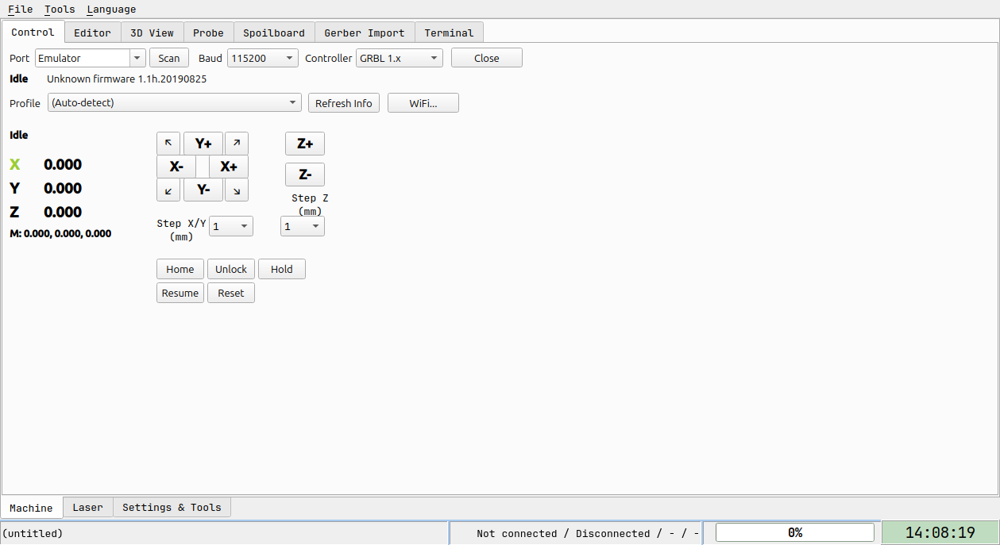

- **DRO** (top-left): live machine/work position for X/Y/Z (and any
  further configured axes).
- **Jog pad**: click a direction to move that step. Step size for X/Y
  and Z are set separately via the two dropdowns. The four diagonal
  arrows (↖↗↙↘) move X and Y together in one command.
- **Keyboard jog**: works anywhere in the app (not just this tab) once
  connected — NumPad 8/2/4/6 = N/S/W/E, NumPad 7/9/1/3 = the diagonals,
  NumPad +/- = Z up/down, NumPad \*// = increase/decrease the X/Y step.
  Ctrl+H = Home, Ctrl+U = Unlock, F6 = Feed Hold, F7 = Resume, Ctrl+X =
  Soft Reset. Rebindable from the **Hotkeys** tab (Settings & Tools
  group) — no more hand-editing `hotkeys.ini` required.
- **Home / Unlock / Hold / Resume / Reset**: the standard grbl realtime
  controls.
- The status bar at the very bottom of the window (visible in every
  screenshot on this page) always shows: the currently loaded file,
  connection/machine state, job progress, and a live clock.

## Editor tab

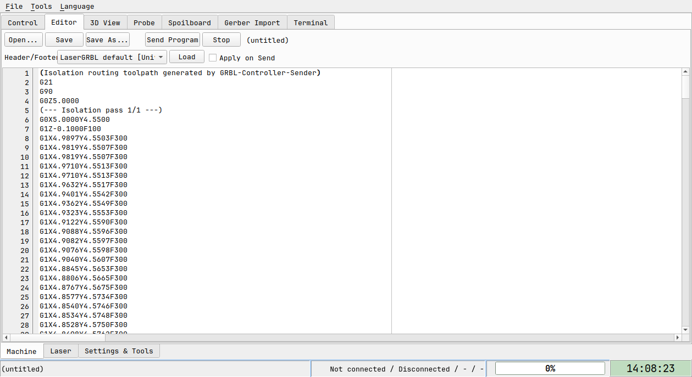

Open, edit and save plain g-code files. **Send Program** streams the
loaded file to the controller; **Stop** aborts and clears the queue.
The **Header/Footer** row lets you pick a named preset (a built-in set
covering common GRBL startup/park sequences, plus your own saved ones)
and, if **Apply on Send** is checked, prepends/appends it automatically
— the same mechanism the Laser Control tab uses, available here for
plain CNC jobs too. Any custom macro button (Settings & Tools → Macros)
flagged "run on job start/end" fires automatically here as well, no
click needed.

The screenshot above happens to show a real isolation-routing program
(loaded via Gerber Import, further down this page) rather than a blank
editor — that's what "the currently loaded program" looks like once
something has actually been generated.

## 3D View tab

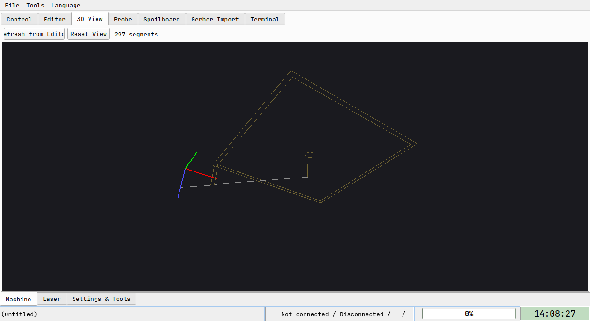

Renders the currently loaded g-code as a toolpath (rapids dim, feed
moves bright — the white lines above are rapids, the yellow outline is
the actual cutting path). Left-drag to orbit, scroll to zoom. Updates
automatically whenever the Editor's content changes; **Refresh from
Editor** re-parses on demand if you ever need to force it, **Reset
View** returns to the default camera angle.

## Probe tab

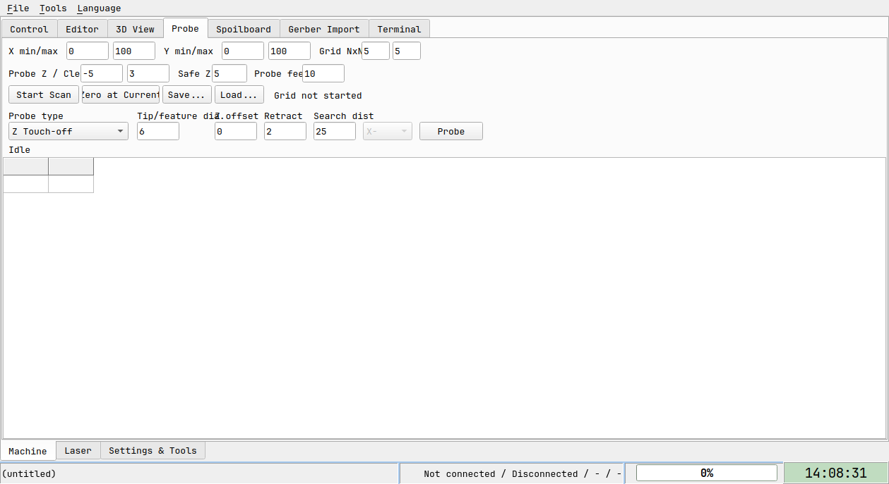

Two independent tools:

- **Grid scan** (top section): define a rectangular area (X/Y min/max),
  a grid resolution, probe clearance/safe-Z/feed, **Start Scan** runs a
  boustrophedon (back-and-forth) height-map scan, **Save.../Load...**
  persists the result, **Zero at Current** treats the current Z as the
  reference plane. Useful for PCB-style surface leveling.
- **Touch probe** (bottom section): pick a **Probe type** (Z touch-off,
  corner/center finding, or edge-finding), fill in the tip/feature
  diameter, offset and search distance, hit **Probe**.

## Spoilboard tab

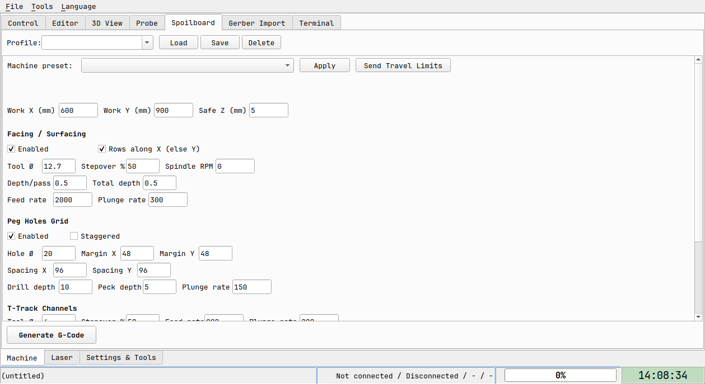

Generates g-code for three spoilboard-prep operations — **Facing/
Surfacing**, a **Peg Holes Grid**, and **T-Track Channels** — from
parametric fields (work area, tool diameter, depths, spacing), each
section independently enabled via its own checkbox. Pick a **Machine
preset** to auto-fill the work area from a real known machine's travel,
and **Send Travel Limits** to push that machine's travel as `$130`/
`$131`/`$132` to the connected controller (it deliberately does NOT
touch soft-limit/homing-enable settings — turn those on yourself in the
Settings tab once you've confirmed your limit switches are actually
wired). **Profile** (top row) saves/loads/deletes your own named
parameter sets, separately from the read-only machine-travel presets.
**Generate G-Code** builds the combined program (always facing first,
then T-tracks, then peg holes) and hands it to the Editor/3D View.

## Gerber Import tab

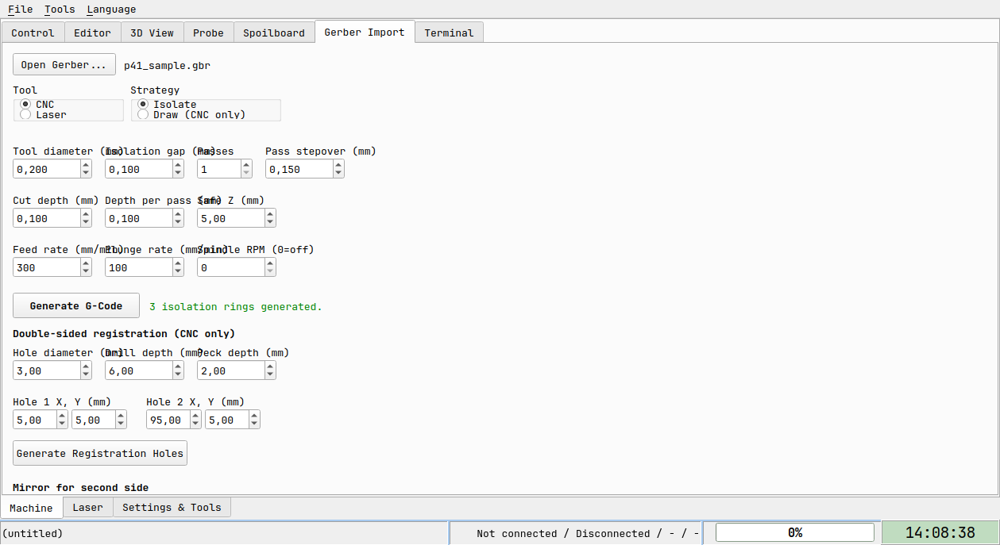

CNC-milling PCB machining from a real Gerber (RS-274X) file — **Open
Gerber...** loads one, then pick:

- **Tool**: CNC mill or Laser (the laser path shares the same geometry,
  just emits `M3 S<power>`/`M5` instead of Z-plunge g-code — no Z axis
  at all).
- **Strategy**: **Isolate** (mills a thin channel around each trace,
  leaving the copper otherwise untouched) or **Draw**, CNC-only (follows
  the trace/pad centerlines directly — a pen or engraving-tip job, not a
  milling one). Picking Laser while Draw is active snaps back to
  Isolate automatically, since laser+Draw isn't a real combination.
  A third strategy, clearing all copper except the traces, is planned
  but not built yet (needs a second board-outline Gerber layer and a
  fill-hatching toolpath generator, neither of which exist yet).
- The usual CNC fields (tool diameter, isolation gap, passes/stepover,
  cut depth, feed/plunge rate, spindle RPM) or laser fields (power,
  feed) depending on **Tool**, then **Generate G-Code**.

**Double-sided registration** (its own section, CNC-only): drills 1-2
small tooling holes at explicit XY positions via **Generate
Registration Holes** — its own small standalone program, separate from
the main toolpath, meant to be run once before machining either side.
Flip the board around dowel pins pushed through those same holes for
the second side, and check **Mirror before generating** (with the right
**Mirror axis X**) before regenerating that side's own toolpath, so it
lands correctly once physically flipped.

## Terminal tab

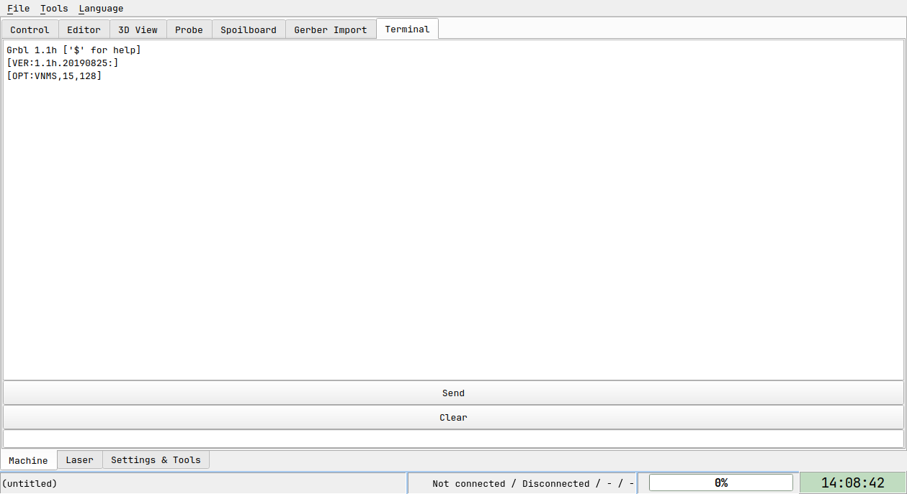

Raw view of what the connected board actually sends back (its own
welcome banner, status reports, `ok`/error responses) — useful for
seeing exactly what's happening at the protocol level, or for sending a
one-off manual command via the **Send** field at the bottom. Only shows
RECEIVED traffic, not lines this app sends out — check the Editor's own
status area or the relevant tab's own status message for confirmation
that something was actually sent.

## Raster Import tab

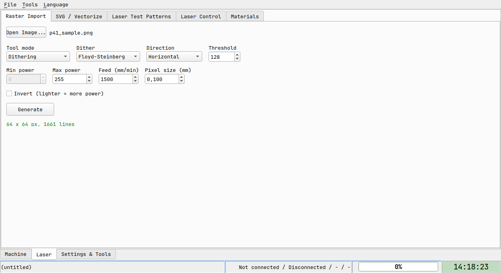

Turns a photo/image into a laser-engraving program. **Open Image...**
loads it, then pick a **Tool mode** (Dithering, or a fixed-threshold/
grayscale-power mode), a **Dither** algorithm (Floyd-Steinberg and 8
others), a scan **Direction**, **Min/Max power**, engraving **Feed**,
and **Pixel size** (the physical size of one image pixel once
engraved — smaller means finer detail and a much longer job). **Invert**
flips the power mapping for a light-background/dark-marking material.
**Generate** produces the program and hands it to the Editor/3D View.

## SVG / Vectorize tab

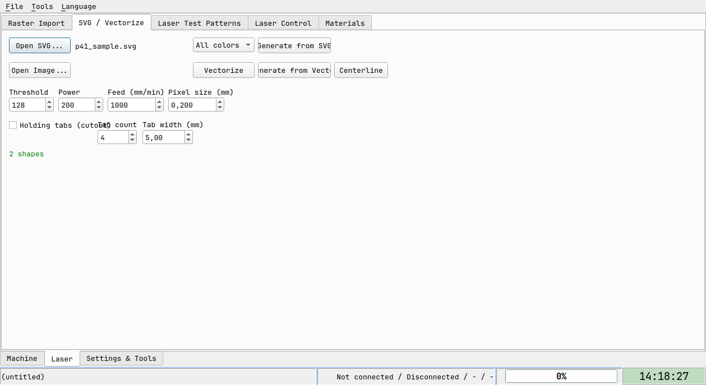

Two independent input paths sharing one output pipeline:

- **Open SVG...**: imports real vector paths directly. The color-filter
  dropdown (default **All colors**) can restrict generation to just one
  stroke/fill color at a time — useful for a multi-color design where
  each color gets its own pass at its own power/feed, re-importing with
  a different filter each time. **Generate from SVG** builds the
  program from whichever shapes match the current filter.
- **Open Image...** + **Vectorize**: turns a raster image into vector
  outlines first (via **Threshold**), then **Generate from Vector**
  builds the program from those; **Centerline** is a separate one-click
  mode for line-art/text where you want the tool to follow the stroke's
  own centerline rather than trace both edges of its outline.

Either path can enable **Holding tabs** for a closed-cutout job — small
uncut bridges at regular intervals (**Tab count**/**Tab width**) so the
freed piece doesn't come loose mid-job; you cut through the last few by
hand afterward.

## Laser Test Patterns tab

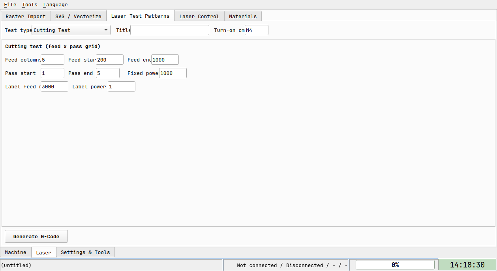

Generates calibration/test programs rather than a real job — pick a
**Test type** (a feed×power or feed×pass grid, depending on type), fill
in the grid's own start/end/column-count fields, an optional **Title**
and per-cell power/feed **Label**, and **Generate G-Code**. Useful for
dialing in a new material's settings before committing to it on the
Materials tab.

## Laser Control tab

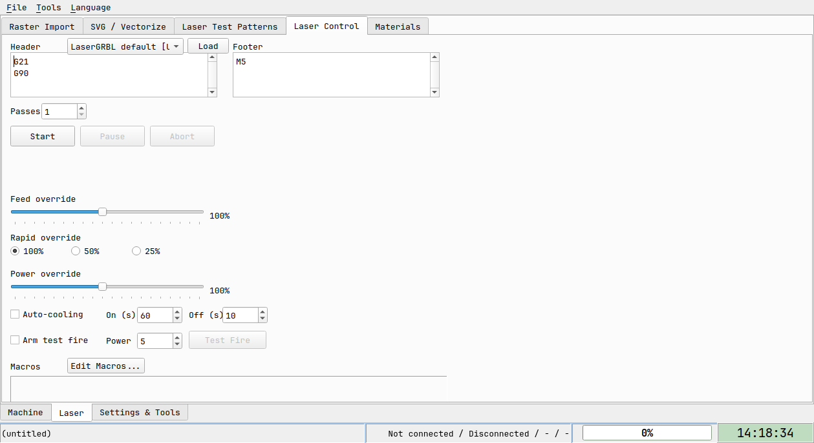

Only appears once a connected board is detected as laser-capable (real
vendor sniffing — Ortur/Aufero/Longer/etc. — from its welcome banner,
or grblHAL's own `$32` laser-mode setting; the built-in offline
emulator doesn't send a matching banner, so this tab stays hidden when
just trying the app without real hardware). The actual job-control
surface for a laser run:

- **Header/Footer**: free-text g-code prepended/appended to every run
  (defaults to LaserGRBL's own real `G21`/`G90` header and `M5`
  footer); **Load** picks a named preset instead of typing one by hand.
- **Passes**: repeats the whole body this many times.
- **Start / Pause / Abort**: the job controls. Abort always forces `M5`
  first, regardless of what was running, on every abort path.
- **Feed / Rapid / Power override**: live sliders/radio buttons sent as
  real-time override commands while a job runs.
- **Auto-cooling**: alternates Feed Hold/Resume at a fixed on/off
  cadence during a run, for a laser that needs periodic rest.
- **Arm test fire**: a deliberate two-step (checkbox + button) safety
  gate before **Test Fire** actually turns the laser on at the given
  power, with no motion.
- **Macros → Edit Macros...**: jumps to the Macros tab (Settings &
  Tools group) to manage the auto-run-capable custom buttons this tab's
  own Start/Abort can trigger.

## Materials tab

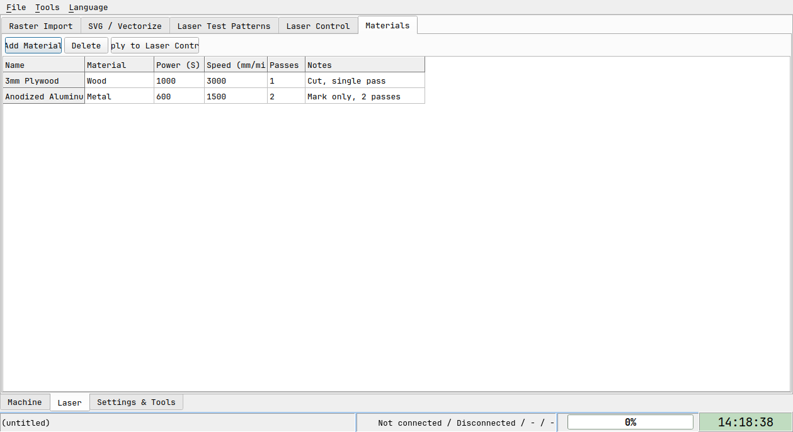

A flat, persisted library of material presets (name, material type,
power, speed, passes, notes) — **Add Material**/**Delete** manage rows,
edit cells directly in the grid, **Apply to Laser Control** pushes the
selected row's power/speed/passes straight into the Laser Control tab
instead of re-typing them by hand each time you switch material.

## Tools tab

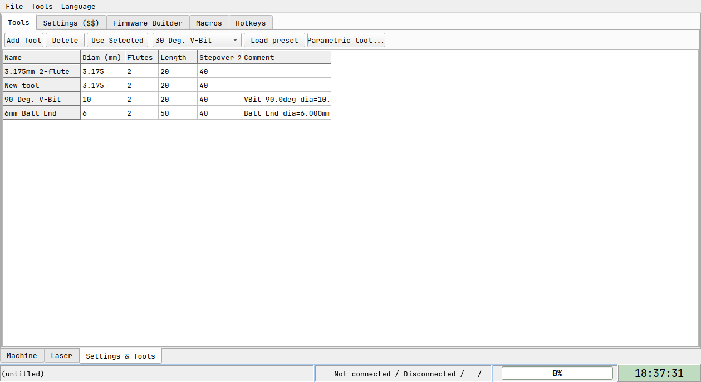

A simple end-mill/bit table (diameter, flutes, length, stepover,
comments), persisted between sessions. **Load preset...** fills a row
from a built-in catalog (real FreeCAD Tool Bit Editor defaults — common
endmill/V-bit/drill sizes); **Parametric tool...** opens a small wizard
that builds a fully-specified tool from a shape template (Endmill/Ball
End/Bull Nose/V-Bit/Drill/Chamfer) plus its own real parameters instead
of picking from a fixed size list.

## Settings ($$) tab

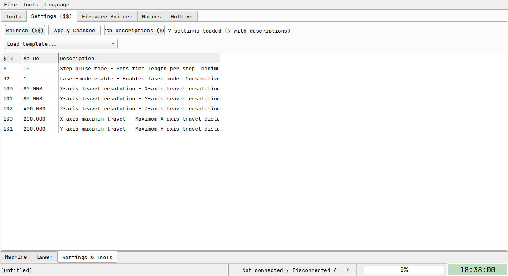

Shows every `$N=value` the board reports. **Refresh** re-reads them;
**Apply** sends back only the rows you actually changed. **Fetch
Descriptions** pulls rich per-setting descriptions from the board if it
supports grblHAL's `$ES` extension; otherwise standard grbl 1.1 settings
still get a human-readable description from a built-in table (the
screenshot above shows the plain-grbl fallback descriptions, since the
offline test emulator used to capture it doesn't implement `$ES`).

## Firmware Builder tab

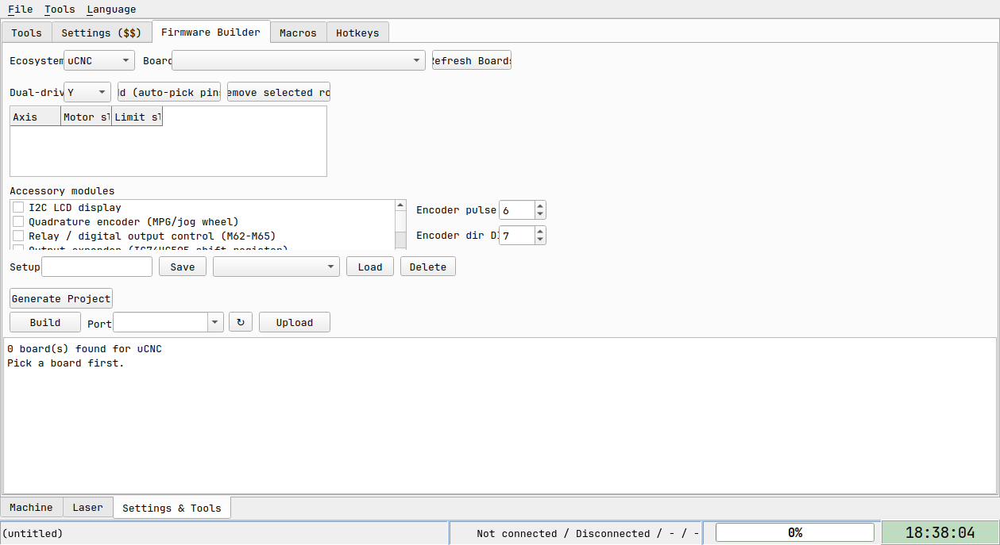

For building custom grblHAL or µCNC firmware with a dual-drive
(auto-squared) axis enabled — pick your board, add an axis with a free
motor/limit slot, Generate the patched project, Build (needs
[PlatformIO](https://platformio.org/) installed), and Upload. This is
independent of any live connection. The board list is populated by
scanning local `uCNC`/`grblHAL` source checkouts under `references/` —
the screenshot shows "0 board(s) found" because this build doesn't have
those external repos checked out; with them present, **Refresh Boards**
lists every real environment found inside.

## FluidNC Config tab

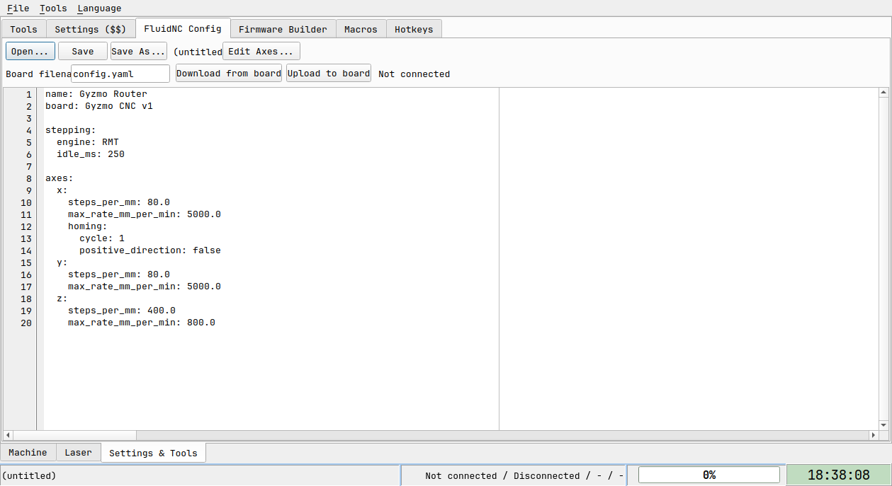

Only appears when a connected board identifies itself as FluidNC.
Download/edit/upload its `config.yaml` directly (raw YAML editor, or use
**Edit Axes...** for a structured axes/motors/homing dialog instead of
hand-editing YAML). The tab is normally hidden with any other firmware —
forced visible here only to capture this screenshot, with sample YAML
typed directly into the editor rather than downloaded from a real board.

## Macros tab

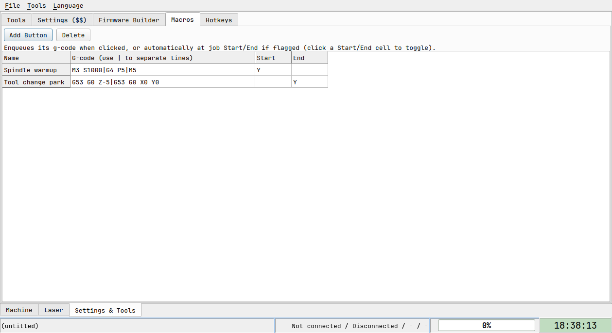

Custom buttons, each enqueuing its own saved g-code when clicked. Two
grid columns (click a cell to toggle) flag a button to also fire
automatically at job **Start**/**End** — for any job, laser or plain
CNC — without a manual click.

## Hotkeys tab

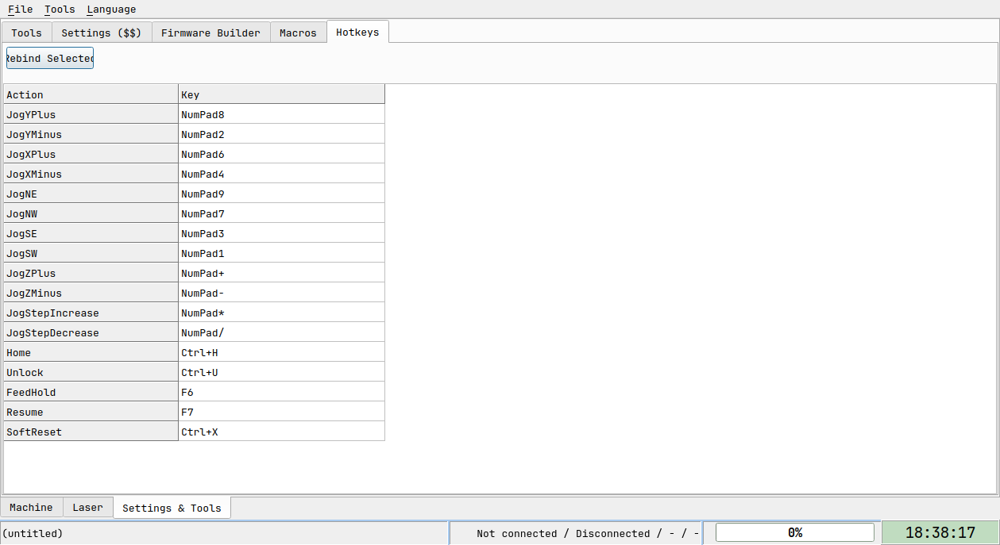

Rebind the keyboard-jog shortcuts listed under the Control tab above,
without hand-editing `hotkeys.ini`.

## Language

**Language** menu: English, Hrvatski, Deutsch. Switches immediately,
persists across restarts. Coverage is thorough but not perfect — a few
fields are still sized for English text and may clip slightly in
Croatian or German (visible in a couple of the screenshots above too —
e.g. Probe's "Probe fee[d]", Gerber Import's field-label overlap, and
SVG/Vectorize's "Generate from SVG"/"Generate from Vect[orize]" buttons
overlapping their neighbors at this window size — all real, all
cosmetic).

## What's not here yet

- The PCB "clear all copper except traces" strategy (Gerber Import tab)
  — needs a board-outline Gerber layer and a fill-hatching toolpath
  generator, neither built yet.
- The stretch-goal modal dialogs (parametric tool wizard, resume-job
  dialog, safety countdown, WiFi config, axis calibration wizard) aren't
  illustrated with screenshots yet — every tab across all three groups
  now is.

If something else seems undocumented or behaves differently than
described here, don't assume it's intentional — open an issue and ask.
